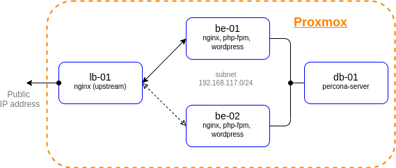
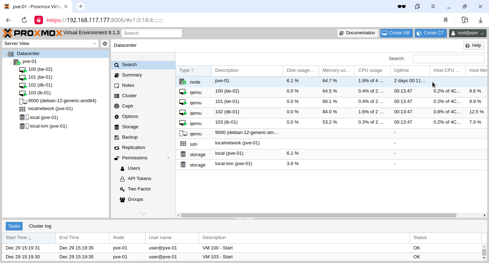
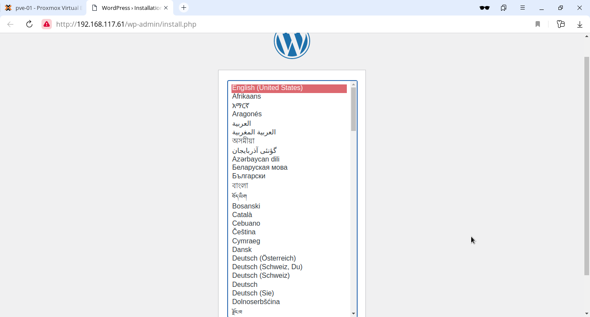
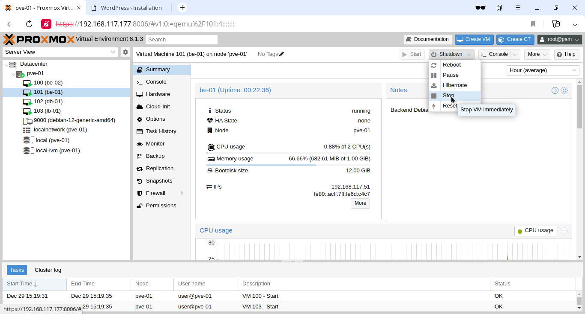

# lab-10
otus | proxmox

### Домашнее задание
развертывание виртуальных машин на proxmox с помощью terraform

#### Цель:
terraform скрипты для развертывания виртуальных машин на проксмоксе

#### Критерии оценки:
Статус "Принято" ставится при выполнении описанного требования.


### Выполнение домашнего задания

#### Создание стенда

Стенд будем разворачивать с помощью Terraform на Proxmox, настройку серверов будем выполнять с помощью Ansible.

Необходимые файлы размещены в репозитории GitHub по ссылке:
```
https://github.com/SergSha/lab-10.git
```

Схема:



Для начала получаем OAUTH токен:
```
https://cloud.yandex.ru/docs/iam/concepts/authorization/oauth-token
```

Настраиваем аутентификации в консоли:
```
export YC_TOKEN=$(yc iam create-token)
export TF_VAR_yc_token=$YC_TOKEN
```

Скачиваем проект с гитхаба:
```
git clone https://github.com/SergSha/lab-10.git && cd ./lab-10
```

В файле provider.tf нужно вставить свой 'cloud_id':
```
cloud_id  = "..."
```

При необходимости в файле main.tf вставить нужные 'ssh_public_key' и 'ssh_private_key', так как по умолчанию соответсвенно id_rsa.pub и id_rsa:
```
ssh_public_key  = "~/.ssh/id_rsa.pub"
ssh_private_key = "~/.ssh/id_rsa"
```

Для того чтобы развернуть стенд, нужно выполнить следующую команду:
```
terraform init && terraform apply -auto-approve && \
sleep 60 && ansible-playbook ./provision.yml
```

По завершению команды получим данные outputs:
```
Outputs:

backend-servers-info = {
  "backend-01" = {
    "ip_address" = tolist([
      "10.10.10.8",
    ])
    "nat_ip_address" = tolist([
      "",
    ])
  }
  "backend-02" = {
    "ip_address" = tolist([
      "10.10.10.16",
    ])
    "nat_ip_address" = tolist([
      "",
    ])
  }
}
consul-servers-info = {
  "consul-01" = {
    "ip_address" = tolist([
      "10.10.10.17",
    ])
    "nat_ip_address" = tolist([
      "",
    ])
  }
  "consul-02" = {
    "ip_address" = tolist([
      "10.10.10.25",
    ])
    "nat_ip_address" = tolist([
      "",
    ])
  }
  "consul-03" = {
    "ip_address" = tolist([
      "10.10.10.4",
    ])
    "nat_ip_address" = tolist([
      "",
    ])
  }
}
db-servers-info = {
  "db-01" = {
    "ip_address" = tolist([
      "10.10.10.20",
    ])
    "nat_ip_address" = tolist([
      "",
    ])
  }
}
iscsi-servers-info = {
  "iscsi-01" = {
    "ip_address" = tolist([
      "10.10.10.24",
    ])
    "nat_ip_address" = tolist([
      "",
    ])
  }
}
nginx-servers-info = {
  "nginx-01" = {
    "ip_address" = tolist([
      "10.10.10.3",
    ])
    "nat_ip_address" = tolist([
      "158.160.23.202",
    ])
  }
  "nginx-02" = {
    "ip_address" = tolist([
      "10.10.10.12",
    ])
    "nat_ip_address" = tolist([
      "158.160.1.253",
    ])
  }
}
```

На всех серверах будут установлены ОС Almalinux 8, настроены смнхронизация времени Chrony, система принудительного контроля доступа SELinux, в качестве firewall будет использоваться NFTables.

Стенд был взят из лабораторной работы 5 https://github.com/SergSha/lab-05. Consul-server развернём на кластере из трёх нод consul-01, consul-02, consul-03. На балансировщиках (nginx-01 и nginx-02) и бэкендах (backend-01 и backend-02) будут установлены клиентские версии Consul. На баланcировщиках также будут установлены и настроены сервис consul-template, которые будут динамически подменять конфигурационные файлы Nginx. На бэкендах будут установлены wordpress. Проверка (check) на доступность сервисов на клиентских серверах будет осуществляться по http.

Так как на YandexCloud ограничено количество выделяемых публичных IP адресов, в качестве JumpHost, через который будем подключаться по SSH (в частности для Ansible) к другим серверам той же подсети будем использовать сервер nginx-01.

Список виртуальных машин после запуска стенда:



Для проверки работы стенда воспользуемся установленным на бэкендах Wordpress:



Значение IP адреса сайта можно получить от одного из балансировщиков, например, nginx-01:




```
wget https://cloud-images.ubuntu.com/focal/current/focal-server-cloudimg-amd64.img
```

```
apt update -y
```

```
apt install libguestfs-tools -y
```

```
virt-customize -a focal-server-cloudimg-amd64.img --install qemu-guest-agent
[   0.0] Examining the guest ...
[  26.6] Setting a random seed
virt-customize: warning: random seed could not be set for this type of 
guest
[  26.7] Setting the machine ID in /etc/machine-id
[  26.7] Installing packages: qemu-guest-agent
[  63.6] Finishing off
```

```
qm create 9000 --name "ubuntu-2004-cloudinit-template" --memory 2048 --cores 2 --net0 virtio,bridge=vmbr0

```


Скачаем iso-образ в директорий /var/lib/vz/template/iso/:
```
root@pve:~# wget https://cdimage.debian.org/debian-cd/current/amd64/iso-cd/debian-12.4.0-amd64-netinst.iso -P /var/lib/vz/template/iso/

root@pve:~# wget http://cloud.debian.org/images/cloud/bookworm/latest/debian-12-generic-amd64.qcow2
```

Создадим новую роль 'TerraformProv':
```
pveum role add TerraformProv -privs "\
Datastore.AllocateSpace \
Datastore.Audit \
Pool.Allocate \
Sys.Audit \
Sys.Console \
Sys.Modify \
VM.Allocate \
VM.Audit \
VM.Clone \
VM.Config.CDROM \
VM.Config.Cloudinit \
VM.Config.CPU \
VM.Config.Disk \
VM.Config.HWType \
VM.Config.Memory \
VM.Config.Network \
VM.Config.Options \
VM.Migrate \
VM.Monitor \
VM.PowerMgmt \
"
```

Создадим нового пользователя 'user':

```
root@pve:~# pveum user add user@pve
root@pve:~#
```

Сгенерируем токен для пользователя 'user':
```
root@pve:~# pveum user token add user@pve terraform --privsep 0
┌──────────────┬──────────────────────────────────────┐
│ key          │ value                                │
╞══════════════╪══════════════════════════════════════╡
│ full-tokenid │ user@pve!terraform                   │
├──────────────┼──────────────────────────────────────┤
│ info         │ {"privsep":0}                        │
├──────────────┼──────────────────────────────────────┤
│ value        │ 26f46a1c-9b1f-40c1-9575-dffa02c8381e │
└──────────────┴──────────────────────────────────────┘
root@pve:~#
```

Добавим роль 'TerraformProv' только что созданному пользователю 'user': 
```
pveum aclmod / -user user@pve -role TerraformProv

root@pve:~# pveum acl modify / --user user@pve --roles TerraformProv
root@pve:~#
```


https://austinsnerdythings.com/2021/08/30/how-to-create-a-proxmox-ubuntu-cloud-init-image/
How to create a Proxmox Ubuntu cloud-init image
Post author
By Austin
Post date
August 30, 2021
33 Commentson How to create a Proxmox Ubuntu cloud-init image
Background for why I wanted to make a Proxmox Ubuntu cloud-init image
I have recently ventured down the path of attempting to learn CI/CD concepts. I have tried docker multiple times and haven’t really enjoyed the nuances any of the times. To me, LXC/LXD containers are far easier to understand than Docker when coming from a ‘one VM per service’ background. LXC/LXD containers can be assigned IP addresses (or get them from DHCP) and otherwise behave basically exactly like a VM from a networking perspective. Docker’s networking model is quite a bit more nuanced. Lots of people say it’s easier, but having everything run on ‘localhost:[high number port]’ doesn’t work well when you’ve got lots of services, unless you do some reverse proxying, like with Traefik or similar. Which is another configuration step.

It is so much easier to just have a LXC get an IP via DHCP and then it’s accessible from hostname right off the bat (I use pfSense for DHCP/DNS – all DHCP leases are entered right into DNS). Regardless, I know Kubernetes is the new hotness so I figured I need to learn it. Every tutorial says you need a master and at least two worker nodes. No sense making three separate virtual machines – let’s use the magic of virtualization and clone some images! I plan on using Terraform to deploy the virtual machines for my Kubernetes cluster (as in, I’ve already used this Proxmox Ubuntu cloud-init image to make my own Kubernetes nodes but haven’t documented it yet).

Overview
The quick summary for this tutorial is:

Download a base Ubuntu cloud image
Install some packages into the image
Create a Proxmox VM using the image
Convert it to a template
Clone the template into a full VM and set some parameters
Automate it so it runs on a regular basis (extra credit)?
???
Profit!
Youtube Video Link
If you prefer video versions to follow along, please head on over to https://youtu.be/1sPG3mFVafE for a live action video of me creating the Proxmox Ubuntu cloud-init image and why we’re running each command.

#1 – Downloading the base Ubuntu image
Luckily, Ubuntu (my preferred distro, guessing others do the same) provides base images that are updated on a regular basis – https://cloud-images.ubuntu.com/. We are interested in the “current” release of Ubuntu 20.04 Focal, which is the current Long Term Support version. Further, since Proxmox uses KVM, we will be pulling that image:

wget https://cloud-images.ubuntu.com/focal/current/focal-server-cloudimg-amd64.img
#2 – Install packages
It took me quite a while into my Terraform debugging process to determine that qemu-guest-agent wasn’t included in the cloud-init image. Why it isn’t, I have no idea. Luckily there is a very cool tool that I just learned about that enables installing packages directly into a image. The tool is called virt-customize and it comes in the libguestfs-tools package (“libguestfs is a set of tools for accessing and modifying virtual machine (VM) disk images” – https://www.libguestfs.org/).

Install the tools:

sudo apt update -y && sudo apt install libguestfs-tools -y
Then install qemu-guest-agent into the newly downloaded image:

sudo virt-customize -a focal-server-cloudimg-amd64.img --install qemu-guest-agent
At this point you can presumably install whatever else you want into the image but I haven’t tested installing other packages. qemu-guest-agent was what I needed to get the VM recognized by Terraform and accessible.

Update 2021-12-30 – it is possible to inject the SSH keys into the cloud image itself before turning it into a template and VM. You need to create a user first and the necessary folders:

# not quite working yet. skip this and continue
#sudo virt-customize -a focal-server-cloudimg-amd64.img --run-command 'useradd austin'
#sudo virt-customize -a focal-server-cloudimg-amd64.img --run-command 'mkdir -p /home/austin/.ssh'
#sudo virt-customize -a focal-server-cloudimg-amd64.img --ssh-inject austin:file:/home/austin/.ssh/id_rsa.pub
#sudo virt-customize -a focal-server-cloudimg-amd64.img --run-command 'chown -R austin:austin /home/austin'
#3 – Create a Proxmox virtual machine using the newly modified image
The commands here should be relatively self explanatory but in general we are creating a VM (VMID=9000, basically every other resource I saw used this ID so we will too) with basic resources (2 cores, 2048MB), assigning networking to a virtio adapter on vmbr0, importing the image to storage (your storage here will be different if you’re not using ZFS, probably either ‘local’ or ‘local-lvm’), setting disk 0 to use the image, setting boot drive to disk, setting the cloud init stuff to ide2 (which is apparently appears as a CD-ROM to the VM, at least upon inital boot), and adding a virtual serial port. I had only used qm to force stop VMs before this but it’s pretty useful.

sudo qm create 9000 --name "ubuntu-2004-cloudinit-template" --memory 2048 --cores 2 --net0 virtio,bridge=vmbr0
sudo qm importdisk 9000 focal-server-cloudimg-amd64.img local-zfs
sudo qm set 9000 --scsihw virtio-scsi-pci --scsi0 local-zfs:vm-9000-disk-0
sudo qm set 9000 --boot c --bootdisk scsi0
sudo qm set 9000 --ide2 local-zfs:cloudinit
sudo qm set 9000 --serial0 socket --vga serial0
sudo qm set 9000 --agent enabled=1
You can start the VM up at this point if you’d like and make any other changes you want because the next step is converting it to a template. If you do boot it, I will be completely honest I have no idea how to log into it. I actually just googled this because I don’t want to leave you without an answer – looks like you can use the same virt-customize we used before to set a root password according to stackoverflow (https://stackoverflow.com/questions/29137679/login-credentials-of-ubuntu-cloud-server-image). Not going to put that into a command window here because cloud-init is really meant for public/private key authentication (see post here for a quick SSH tutorial).

#4 – Convert VM to a template
Ok if you made any changes, shut down the VM. If you didn’t boot the VM, that’s perfectly fine also. We need to convert it to a template:

sudo qm template 9000
And now we have a functioning template!

screenshot of proxmox ui showing ubuntu 20.04 cloud-init template
#5 – Clone the template into a full VM and set some parameters
From this point you can clone the template as much as you want. But, each time you do so it makes sense to set some parameters, namely the SSH keys present in the VM as well as the IP address for the main interface. You could also add the SSH keys with virt-customize but I like doing it here.

First, clone the VM (here we are cloning the template with ID 9000 to a new VM with ID 999):

sudo qm clone 9000 999 --name test-clone-cloud-init
Next, set the SSH keys and IP address:

sudo qm set 999 --sshkey ~/.ssh/id_rsa.pub
sudo qm set 999 --ipconfig0 ip=10.98.1.96/24,gw=10.98.1.1
It’s now ready to start up!

sudo qm start 999
You should be able to log in without any problems (after trusting the SSH fingerprint). Note that the username is ‘ubuntu’, not whatever the username is for the key you provided.

ssh ubuntu@10.98.1.96
Once you’re happy with how things worked, you can stop the VM and clean up the resources:

sudo qm stop 999 && sudo qm destroy 999
rm focal-server-cloudimg-amd64.img
#6 – automating the process
I have not done so yet, but if you create VMs on a somewhat regular basis, it wouldn’t be hard to stick all of the above into a simple shell script (update 2022-04-19: simple shell script below) and run it via cron on a weekly basis or whatever frequency you prefer. I can’t tell you how many times I make a new VM from whatever .iso I downloaded and the first task is apt upgrade taking forever to run (‘sudo apt update’ –> “176 packages can be upgraded”). Having a nice template always ready to go would solve that issue and would frankly save me a ton of time.

#6.5 – Shell script to create template
# installing libguestfs-tools only required once, prior to first run
sudo apt update -y
sudo apt install libguestfs-tools -y
# remove existing image in case last execution did not complete successfully
rm focal-server-cloudimg-amd64.img
wget https://cloud-images.ubuntu.com/focal/current/focal-server-cloudimg-amd64.img
sudo virt-customize -a focal-server-cloudimg-amd64.img --install qemu-guest-agent
sudo qm create 9000 --name "ubuntu-2004-cloudinit-template" --memory 2048 --cores 2 --net0 virtio,bridge=vmbr0
sudo qm importdisk 9000 focal-server-cloudimg-amd64.img local-zfs
sudo qm set 9000 --scsihw virtio-scsi-pci --scsi0 local-zfs:vm-9000-disk-0
sudo qm set 9000 --boot c --bootdisk scsi0
sudo qm set 9000 --ide2 local-zfs:cloudinit
sudo qm set 9000 --serial0 socket --vga serial0
sudo qm set 9000 --agent enabled=1
sudo qm template 9000
rm focal-server-cloudimg-amd64.img
echo "next up, clone VM, then expand the disk"
echo "you also still need to copy ssh keys to the newly cloned VM"
#7-8 – Using this template with Terraform to automate VM creation
Next post – How to deploy VMs in Proxmox with Terraform

References
https://matthewkalnins.com/posts/home-lab-setup-part-1-proxmox-cloud-init/
https://registry.terraform.io/modules/sdhibit/cloud-init-vm/proxmox/latest/examples/ubuntu_single_vm

My original notes
https://matthewkalnins.com/posts/home-lab-setup-part-1-proxmox-cloud-init/
https://registry.terraform.io/modules/sdhibit/cloud-init-vm/proxmox/latest/examples/ubuntu_single_vm
# create cloud image VM
wget https://cloud-images.ubuntu.com/focal/20210824/focal-server-cloudimg-amd64.img
sudo qm create 9000 --name "ubuntu-2004-cloudinit-template" --memory 2048 --cores 2 --net0 virtio,bridge=vmbr0
# to install qemu-guest-agent or whatever into the guest image
#sudo apt-get install libguestfs-tools
#virt-customize -a focal-server-cloudimg-amd64.img --install qemu-guest-agent
sudo qm importdisk 9000 focal-server-cloudimg-amd64.img local-zfs
sudo qm set 9000 --scsihw virtio-scsi-pci --scsi0 local-zfs:vm-9000-disk-0
sudo qm set 9000 --boot c --bootdisk scsi0
sudo qm set 9000 --ide2 local-zfs:cloudinit
sudo qm set 9000 --serial0 socket --vga serial0
sudo qm template 9000
# clone cloud image to new VM
sudo qm clone 9000 999 --name test-clone-cloud-init
sudo qm set 999 --sshkey ~/.ssh/id_rsa.pub
sudo qm set 999 --ipconfig0 ip=10.98.1.96/24,gw=10.98.1.1
sudo qm start 999
  
# remove known host because SSH key changed
ssh-keygen -f "/home/austin/.ssh/known_hosts" -R "10.98.1.96"
# ssh in
ssh -i ~/.ssh/id_rsa ubuntu@10.98.1.96
# stop and destroy VM
sudo qm stop 999 && sudo qm destroy 999
 Post Views: 44,979